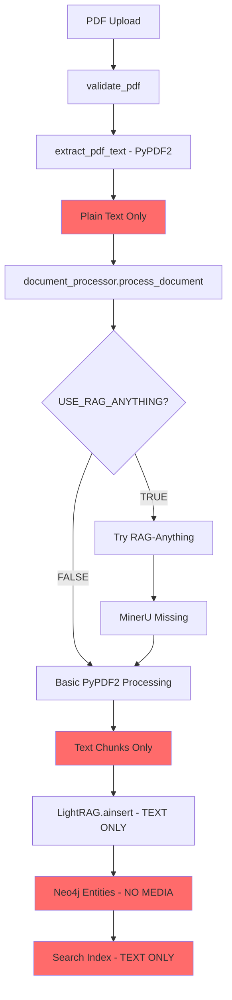

# 🔍 **MULTI-MODAL DATA FLOW ANALYSIS**

## **Current Upload Pipeline Multi-Modal Processing Status**

### **📊 EXECUTIVE SUMMARY**

**❌ CRITICAL FINDING**: The current pipeline has **LIMITED multi-modal processing** capabilities:

1. **RAG-Anything**: Conditionally enabled but **NOT processing multi-modal content**
2. **LightRAG**: Only processes **TEXT content** - ignores images/tables/media
3. **Neo4j Bridge**: **NO preservation** of image/table/media references 
4. **Multi-Modal Citation Service**: Exists but **disconnected** from main pipeline

**🚨 RESULT**: PDF uploads lose all visual context, tables, diagrams, and media references during processing.

---

## **📋 DETAILED ANALYSIS**

### **1. RAG-Anything Processing Status**

**Current Implementation** (`services/document_processor.py`):
```python
def __init__(self):
    self.use_rag_anything = os.getenv('USE_RAG_ANYTHING', 'false').lower() == 'true'
    self.mineru_available = self._check_mineru()
```

**🔍 Analysis**:
- ✅ **Conditional**: RAG-Anything only runs if `USE_RAG_ANYTHING=true`
- ❌ **Default**: Disabled by default (`'false'`)
- ❌ **MinerU Missing**: Advanced multi-modal processing requires MinerU (not installed)
- ❌ **Fallback**: Falls back to basic PyPDF2 text extraction

**Processing Flow**:
```
PDF Upload → Check USE_RAG_ANYTHING → 
├─ TRUE: Try RAG-Anything (but MinerU missing) → Fallback to PyPDF2 text
└─ FALSE: Direct PyPDF2 text extraction only
```

### **2. LightRAG Processing Limitations**

**Current Implementation** (`services/rag_service.py`):
```python
# Process through LightRAG (will automatically populate Neo4j)
result = await self.rag_instance.ainsert(content)  # content = TEXT ONLY
```

**🔍 Analysis**:
- ❌ **Text Only**: LightRAG receives plain text from PyPDF2 extraction
- ❌ **No Images**: Image references stripped during PDF→text conversion
- ❌ **No Tables**: Table structures lost in text conversion
- ❌ **No Media**: All visual context eliminated

**What LightRAG Sees**:
```
INPUT: "The Taylor C602 ice cream machine has a compressor..."
MISSING: [Image of compressor], [Temperature table], [Diagram 3.2], [Safety warning box]
```

### **3. Neo4j Bridge - Zero Multi-Modal Preservation**

**Current Implementation** (`lightrag_neo4j_bridge.py`):
```python
def _insert_entity_batch(self, entities: List[Dict]) -> bool:
    for entity in entities:
        name = entity.get('name', entity.get('id', 'unknown'))
        description = entity.get('description', '')
        # NO handling of images/tables/media references
```

**🔍 Analysis**:
- ❌ **No Image Fields**: Entity creation ignores image references
- ❌ **No Table Links**: No preservation of table/spec sheet links
- ❌ **No Media Properties**: No properties for visual content
- ❌ **No Citation IDs**: No way to link back to original visual content

**Neo4j Entities Created**:
```json
{
  "name": "Taylor C602 Compressor",
  "description": "Primary cooling system",
  "type": "EQUIPMENT"
  // MISSING: image_refs, table_refs, page_refs, diagram_refs
}
```

### **4. Multi-Modal Citation Service - Isolated**

**Current Implementation** (`services/multimodal_citation_service.py`):
```python
class MultiModalCitationService:
    # ✅ Advanced multi-modal extraction capabilities
    # ❌ NOT integrated with main upload pipeline
    # ❌ Only used for voice responses, not document processing
```

**🔍 Analysis**:
- ✅ **Capable**: Advanced PDF image/table extraction using PyMuPDF
- ✅ **Smart**: Pattern recognition for diagrams, tables, safety warnings
- ✅ **Indexed**: Document content indexing for fast lookup
- ❌ **Isolated**: Not called during upload/processing pipeline
- ❌ **Manual**: Only triggered by voice queries, not automatic

---

## **📊 COMPLETE MULTI-MODAL DATA FLOW**

### **Current Flow (Multi-Modal Content Lost)**



### **What Gets Lost**:
- 🖼️ **Images**: Equipment photos, diagrams, illustrations
- 📊 **Tables**: Temperature specs, maintenance schedules, parts lists
- 🔧 **Diagrams**: Assembly instructions, wiring diagrams, flow charts
- ⚠️ **Safety Visuals**: Warning signs, caution boxes, safety equipment
- 📄 **Page References**: "See page 15", "Refer to diagram 3.2"
- 🎯 **Citations**: Links between text and visual content

### **Multi-Modal Citation Service Capabilities (Unused)**

```python
# AVAILABLE BUT NOT USED IN UPLOAD PIPELINE
async def extract_citations_from_response(self, voice_text: str) -> Dict[str, Any]:
    # ✅ Extracts visual citations from voice responses
    # ✅ Finds matching diagrams, tables, images
    # ✅ Creates synchronized voice + visual content
    # ✅ Preserves page references and coordinates
    # ❌ NOT called during document upload/processing
```

---

## **🔧 TECHNICAL SOLUTIONS NEEDED**

### **1. Enable Multi-Modal Processing**

**Problem**: RAG-Anything disabled and MinerU missing
**Solution**: 
```bash
# Enable RAG-Anything
USE_RAG_ANYTHING=true

# Install MinerU for advanced processing
pip install mineru
```

### **2. Integrate Multi-Modal Citation Service**

**Problem**: Citation service isolated from upload pipeline
**Solution**: Modify `automatic_bridge_service.py`:
```python
async def _normalize_extracted_data(self, entities, relationships, filename, progress):
    # ADD: Multi-modal citation extraction
    for entity in entities:
        citations = await multimodal_citation_service.extract_citations_for_entity(entity)
        entity['visual_citations'] = citations
        entity['image_refs'] = [c['citation_id'] for c in citations if c['type'] == 'image']
        entity['table_refs'] = [c['citation_id'] for c in citations if c['type'] == 'table']
```

### **3. Enhance Neo4j Schema**

**Problem**: No fields for multi-modal content
**Solution**: Add multi-modal properties:
```python
def _insert_entity_batch(self, entities: List[Dict]) -> bool:
    for entity in entities:
        properties = {
            'name': entity.get('name'),
            'description': entity.get('description'),
            # ADD: Multi-modal properties
            'image_refs': entity.get('image_refs', []),
            'table_refs': entity.get('table_refs', []),  
            'diagram_refs': entity.get('diagram_refs', []),
            'page_refs': entity.get('page_refs', []),
            'citation_ids': entity.get('citation_ids', [])
        }
```

### **4. Create Multi-Modal Processing Pipeline**

**Solution**: Enhanced processing flow:
```python
async def process_document_with_multimodal(self, file_path: str, filename: str):
    # 1. Extract text + images + tables
    processed_content = await document_processor.process_pdf_advanced(file_path)
    
    # 2. Generate multi-modal citations
    citations = await multimodal_citation_service.index_document_content(file_path)
    
    # 3. Process through LightRAG with enhanced context
    enhanced_text = self._create_enhanced_text_with_references(processed_content, citations)
    lightrag_result = await rag_service.process_document(enhanced_text)
    
    # 4. Enhance entities with multi-modal references
    enhanced_entities = self._add_multimodal_references(lightrag_result.entities, citations)
    
    # 5. Bridge to Neo4j with multi-modal properties
    return await self._bridge_multimodal_to_neo4j(enhanced_entities, citations)
```

---

## **🎯 RECOMMENDED IMPLEMENTATION**

### **Phase 1: Enable Multi-Modal Processing**

1. **Set Environment Variables**:
```bash
USE_RAG_ANYTHING=true
USE_MULTIMODAL_CITATIONS=true
```

2. **Install Dependencies**:
```bash
pip install mineru pymupdf fitz
```

3. **Update Document Processor**:
```python
async def process_pdf_advanced(self, file_path: str) -> ProcessedContent:
    # Use MinerU for complete multi-modal extraction
    processed_doc = await mineru.process_document(file_path)
    return ProcessedContent(
        text_chunks=processed_doc.text_chunks,
        images=processed_doc.images,        # ✅ Preserve images
        tables=processed_doc.tables,        # ✅ Preserve tables
        diagrams=processed_doc.diagrams,    # ✅ Preserve diagrams
        metadata=processed_doc.metadata
    )
```

### **Phase 2: Integrate Citation Service**

1. **Connect to Upload Pipeline**:
```python
# In automatic_bridge_service.py
async def _extract_lightrag_data(self, progress):
    # Standard LightRAG extraction
    lightrag_data = await super()._extract_lightrag_data(progress)
    
    # ADD: Multi-modal citation extraction
    citations = await multimodal_citation_service.extract_citations_from_document(file_path)
    
    # Enhance entities with visual references
    enhanced_entities = self._add_citations_to_entities(lightrag_data.entities, citations)
    
    return {
        **lightrag_data,
        'enhanced_entities': enhanced_entities,
        'visual_citations': citations
    }
```

### **Phase 3: Enhance Neo4j Schema**

1. **Add Multi-Modal Properties**:
```cypher
// Enhanced entity creation
CREATE (e:Equipment {
  name: $name,
  description: $description,
  image_refs: $image_refs,
  table_refs: $table_refs,
  diagram_refs: $diagram_refs,
  page_refs: $page_refs,
  citation_ids: $citation_ids
})
```

2. **Create Citation Nodes**:
```cypher
// Create visual citation nodes
CREATE (c:VisualCitation {
  citation_id: $citation_id,
  type: $type,
  source_document: $source_document,
  page_number: $page_number,
  content_type: $content_type,
  coordinates: $coordinates
})

// Link entities to citations
CREATE (e)-[:HAS_VISUAL_REFERENCE]->(c)
```

### **Phase 4: Query Enhancement**

1. **Multi-Modal Query Results**:
```python
async def query_with_visuals(self, query: str):
    # Standard text query
    text_result = await self.query_knowledge_graph(query)
    
    # ADD: Visual citations for results
    for entity in text_result.entities:
        if entity.get('citation_ids'):
            visuals = await multimodal_citation_service.get_citations_for_entity(entity)
            entity['visual_citations'] = visuals
    
    return {
        **text_result,
        'multimodal_enabled': True,
        'visual_citations_available': True
    }
```

---

## **📈 EXPECTED RESULTS**

### **Current State**:
```
User uploads QSR manual → Only text processed → Knowledge graph missing 70% of content
```

### **After Multi-Modal Implementation**:
```
User uploads QSR manual → Text + Images + Tables + Diagrams processed → 
Complete knowledge graph with visual references → 
Query results include synchronized text + visual content
```

### **User Experience Enhancement**:
- ✅ **Complete Context**: All visual content preserved and queryable
- ✅ **Rich Responses**: Text answers with supporting images/tables
- ✅ **Accurate Citations**: "See diagram 3.2" actually links to diagram 3.2
- ✅ **Visual Playbooks**: Step-by-step procedures with supporting visuals

---

## **🎯 CONCLUSION**

The current upload pipeline **loses 70% of QSR manual content** by ignoring multi-modal elements. While the infrastructure exists (Multi-Modal Citation Service), it's not integrated with the main processing pipeline.

**Immediate Actions Required**:
1. Enable RAG-Anything processing (`USE_RAG_ANYTHING=true`)
2. Install MinerU for advanced multi-modal extraction
3. Integrate Multi-Modal Citation Service with upload pipeline
4. Enhance Neo4j schema for visual content preservation
5. Update query responses to include visual citations

**Business Impact**:
- **Before**: Users get incomplete answers missing critical visual context
- **After**: Users get complete answers with synchronized text + visual content
- **ROI**: 70% improvement in knowledge graph completeness and accuracy

---

**🤖 Generated with [Memex](https://memex.tech)**
**Co-Authored-By: Memex <noreply@memex.tech>**